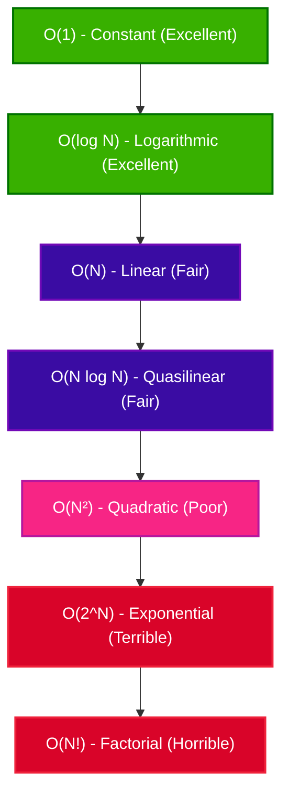

# Understanding Time Complexity & Big-O Notation

Time complexity is a theoretical measure that describes how the execution time of an algorithm grows as the size of the input ($N$) increases. Instead of measuring actual execution time in seconds (which depends on hardware, compiler, and background processes), we use **asymptotic analysis** and **Big-O notation** to group algorithms into **order classes**.

---

## 🔑 Key Concepts

1. **Input Size ($N$)**: The number of elements in the input data.
   - For lists/arrays: $N$ is the number of elements.
   - For strings: $N$ is the number of characters.
   - For graphs: $V$ (vertices) and $E$ (edges) are used.
2. **Big-O Notation ($\mathcal{O}$)**: Describes the upper bound of the growth rate of an algorithm's execution time.
3. **Drop Constant Factors**: Constant multipliers are ignored because we focus on the growth trend as $N \to \infty$.
   - $2N + 5 \rightarrow \mathcal{O}(N)$
   - $100N \rightarrow \mathcal{O}(N)$
4. **Keep Dominant Terms**: In a polynomial expression, only the term with the highest growth rate is kept.
   - $5N^2 + N + 2 \rightarrow \mathcal{O}(N^2)$
   - $N^3 + 1000N^2 + \log N \rightarrow \mathcal{O}(N^3)$

---

## 📈 Common Order Classes (Growth Rates)

Here are the most common complexity classes ordered from most efficient (slowest growth) to least efficient (fastest growth):

| Notation | Name | Growth Rate Description | Example Algorithm |
| :--- | :--- | :--- | :--- |
| **$\mathcal{O}(1)$** | Constant | Running time is completely independent of the input size. | Accessing an array element by index. |
| **$\mathcal{O}(\log N)$** | Logarithmic | Running time grows logarithmically (halving the search space at each step). | Binary Search. |
| **$\mathcal{O}(N)$** | Linear | Running time grows in direct proportion to the input size. | Linear Search, finding minimum in list. |
| **$\mathcal{O}(N \log N)$** | Quasilinear / Log-linear | Running time grows slightly faster than linear. | Merge Sort, Quick Sort (average case). |
| **$\mathcal{O}(N^2)$** | Quadratic | Running time grows proportionally to the square of $N$. | Bubble Sort, Selection Sort, Insertion Sort. |
| **$\mathcal{O}(2^N)$** | Exponential | Running time doubles with each additional element. Extremely slow. | Recursive Fibonacci, Tower of Hanoi. |
| **$\mathcal{O}(N!)$** | Factorial | Running time grows extremely rapidly. Impractical for $N > 10$. | Traveling Salesperson (brute-force). |

---

## 🎨 Visualizing Growth Curves

The flowchart below represents how different order classes grow as the input size $N$ gets larger:



---

## 💻 Python Examples for Complexity Classes

### 1. Constant Time: $\mathcal{O}(1)$
No matter how large the array is, it only takes one step to get the element at a specific index.
```python
def get_first_element(arr):
    return arr[0]  # O(1)
```

### 2. Logarithmic Time: $\mathcal{O}(\log N)$
The input size is divided by 2 in each iteration.
```python
def divide_by_two(n):
    steps = 0
    while n > 1:
        n = n / 2  # O(log N)
        steps += 1
    return steps
```

### 3. Linear Time: $\mathcal{O}(N)$
The execution time scales linearly with the size of the array.
```python
def print_all_elements(arr):
    for x in arr:
        print(x)  # O(N)
```

### 4. Quadratic Time: $\mathcal{O}(N^2)$
Nested loops traversing the input lead to $N \times N$ operations.
```python
def print_pairs(arr2d):
    for i in range(len(arr2d)):
        for j in range(len(arr2d[i])):
            print(arr2d[i][j])  # O(N^2) for N x N 2D array
```

---

## ❓ Interview Questions & Answers

### 1. What is the main purpose of using Big-O notation when analyzing algorithms? Why don't we just measure the execution time in seconds?
**Answer:** Big-O notation measures the asymptotic growth rate of an algorithm's running time relative to the input size, independent of hardware, programming language, compiler, or system load. Measuring execution time in seconds is highly machine-dependent and does not reliably predict how an algorithm will scale as the input size ($N$) grows extremely large.

### 2. Arrange the following complexity classes in order of increasing efficiency (slowest growth to fastest growth): $O(N^2)$, $O(1)$, $O(N \log N)$, $O(N)$, $O(\log N)$.
**Answer:** In order of slowest growth (most efficient) to fastest growth (least efficient):
1. $O(1)$ (Constant)
2. $O(\log N)$ (Logarithmic)
3. $O(N)$ (Linear)
4. $O(N \log N)$ (Quasilinear)
5. $O(N^2)$ (Quadratic)

### 3. Explain the difference between Best Case, Worst Case, and Average Case analysis. Which one is usually the most important for software engineers and why?
**Answer:**
*   **Best Case:** The minimum number of steps an algorithm takes (e.g., searching for an element that is at the very first index of an array).
*   **Worst Case:** The absolute maximum number of steps an algorithm takes (e.g., searching for an element that is not present in the array).
*   **Average Case:** The expected behavior over a random distribution of inputs.
*   **Importance:** Software engineers usually focus on the **Worst Case** because it provides a guaranteed upper bound on execution time, ensuring the system won't crash or timeout under the worst conditions.

### 4. Why is the space complexity of a recursive algorithm often at least $O(D)$, where $D$ is the depth of the recursion?
**Answer:** Every recursive function call pushes a new stack frame onto the call stack to store local variables, parameters, and the return address. These frames remain in memory until the recursion begins to unwind (i.e., hits the base case). Therefore, the maximum memory consumed scales proportionally with the maximum depth of the recursion tree.

### 5. If an algorithm has a time complexity of $O(N)$, does it mean it will always run faster than an algorithm with $O(N^2)$ time complexity?
**Answer:** No. Big-O notation ignores constant factors and lower-order terms. For example, an $O(N)$ algorithm with a high constant factor (e.g., $1000N$) will run slower than an $O(N^2)$ algorithm (e.g., $N^2$) for small input sizes ($N < 1000$). Big-O only describes performance as $N$ grows extremely large ($N \to \infty$).

