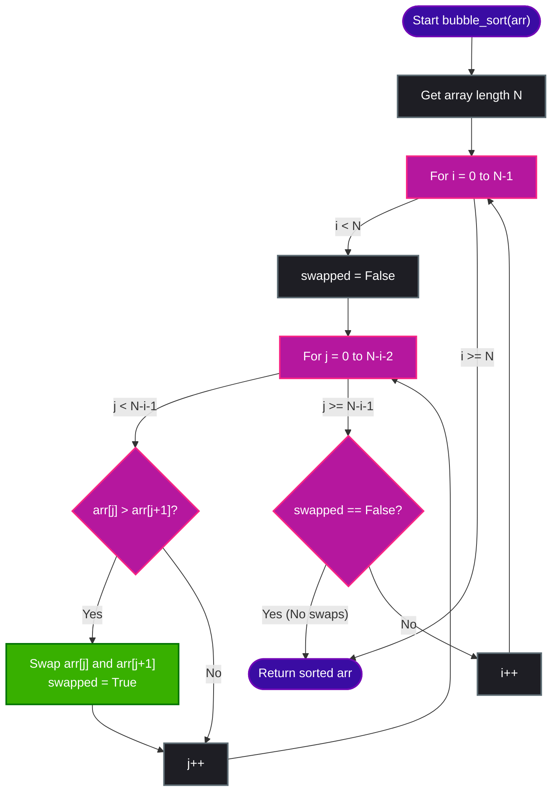

# Bubble Sort Algorithm

Bubble Sort is a simple, comparison-based sorting algorithm. It works by repeatedly stepping through the list to be sorted, comparing adjacent elements, and swapping them if they are in the wrong order. This pass through the list is repeated until the list is sorted.

The algorithm gets its name because smaller elements "bubble" to the top (or larger elements sink to the bottom) of the list.

---

## 🔑 Key Concepts

1. **Adjacent Comparisons**: In each pass, we compare index `j` with index `j + 1`.
2. **Swapping**: If the element at `j` is greater than `j + 1`, we swap them (for ascending order).
3. **Shrinking Unsorted Part**: In each full pass, the largest unsorted element "bubbles up" to its correct position at the end. Thus, in the next pass, we can ignore the last sorted element (we only need to scan up to `n - i - 1`).
4. **Early Exit (Optimized)**: If a full pass completes without any swaps, the array is already sorted, and we can terminate early.

---

## 🎨 Visualizing Bubble Sort (Pass-by-Pass)

Let us sort the array `[11, 2, 4, 8, 5]` using Bubble Sort.

### Legend
- `j` and `j+1` represent the elements being compared.
- `════` double border represents the sorted sub-array portion at the right.

---

### Pass 1
Traverse the unsorted array from index `0` to `n-1`.

#### Step 1: Compare index 0 and 1 `[11, 2, 4, 8, 5]`
- `11 > 2` $\rightarrow$ Swap.
```text
    Swap
   ┌────┬────┐
   │ 11 │  2 │  4 │  8 │  5 │
   └────┴────┘
```

#### Step 2: Compare index 1 and 2 `[2, 11, 4, 8, 5]`
- `11 > 4` $\rightarrow$ Swap.
```text
         Swap
        ┌────┬────┐
   │  2 │ 11 │  4 │  8 │  5 │
   └────┴────┴────┘
```

#### Step 3: Compare index 2 and 3 `[2, 4, 11, 8, 5]`
- `11 > 8` $\rightarrow$ Swap.
```text
              Swap
             ┌────┬────┐
   │  2 │  4 │ 11 │  8 │  5 │
   └────┴────┴────┴────┘
```

#### Step 4: Compare index 3 and 4 `[2, 4, 8, 11, 5]`
- `11 > 5` $\rightarrow$ Swap.
```text
                   Swap
                  ┌────┬════┐
   │  2 │  4 │  8 │ 11 │  5 ║ (11 bubbles to the end)
   └────┴────┴────┴────┴════┘
```

**Result of Pass 1:** `[2, 4, 8, 5, 11]` (Last element `11` is now in its sorted position).

---

### Pass 2
Traverse from index `0` to `n-2` (`[2, 4, 8, 5]`).

- Compare `2` and `4` $\rightarrow$ No swap (`2 <= 4`).
- Compare `4` and `8` $\rightarrow$ No swap (`4 <= 8`).
- Compare `8` and `5` $\rightarrow$ Swap (`8 > 5`).
```text
                   Swap
                  ┌────┬────┬═════╪
   │  2 │  4 │  5 │  8 │ 11 ║ (8 and 11 are sorted)
   └────┴────┴────┴────┴═════╪
```

**Result of Pass 2:** `[2, 4, 5, 8, 11]`.

---

### Pass 3
Traverse from index `0` to `n-3` (`[2, 4, 5]`).

- Compare `2` and `4` $\rightarrow$ No swap.
- Compare `4` and `5` $\rightarrow$ No swap.
- No swaps occurred in this pass, meaning the array is fully sorted!

**Final Sorted Array:** `[2, 4, 5, 8, 11]`

---

## 📈 Mermaid Bubble Sort Flowchart



---

## 💻 Python Code Implementation

This Python implementation sorts the array in-place and includes an optimization flag (`swapped`) to exit early if the array becomes sorted.

```python
def bubble_sort(arr):
    n = len(arr)
    
    # Outer loop to traverse through all array elements
    for i in range(n):
        swapped = False
        
        # Inner loop to compare adjacent elements
        # Last i elements are already in place
        for j in range(0, n - i - 1):
            if arr[j] > arr[j + 1]:
                # Swap elements if they are in wrong order
                arr[j], arr[j + 1] = arr[j + 1], arr[j]
                swapped = True
                
        # If no two elements were swapped by inner loop, then break
        if not swapped:
            break
            
    return arr


# --- Execution Example ---
if __name__ == "__main__":
    test_arr = [11, 2, 4, 8, 5, 6, 7, 3, 9, 10]
    print("Unsorted Array:", test_arr)
    
    sorted_arr = bubble_sort(test_arr)
    print("Sorted Array:  ", sorted_arr)
```

---

## 📊 Complexity Analysis

### ⏱️ Time Complexity

| Case | Time Complexity | Explanation |
| :--- | :---: | :--- |
| **Best Case** | $\mathcal{O}(N)$ | Occurs when the input array is already sorted. The outer loop runs once, and the inner loop performs $N-1$ comparisons with zero swaps, triggering early termination. |
| **Average Case**| $\mathcal{O}(N^2)$ | On average, Bubble Sort takes $\frac{N(N-1)}{2}$ comparisons and swaps. |
| **Worst Case** | $\mathcal{O}(N^2)$ | Occurs when the input array is sorted in reverse order, requiring nested loops to run fully and perform swaps at every step. |

### 💾 Space Complexity

- **Space Complexity**: $\mathcal{O}(1)$ (Auxiliary)
- **Explanation**: Bubble Sort is an **in-place** sorting algorithm. It only requires a constant amount of extra memory space for temporary pointer values and swaps.

---

## ❓ Interview Questions & Answers

### 1. Explain the core mechanism of the Bubble Sort algorithm. Why is it called "Bubble" Sort?
**Answer:** Bubble Sort works by repeatedly stepping through the array, comparing adjacent elements, and swapping them if they are in the incorrect order. It is called "Bubble" Sort because in each pass, the largest unsorted element gradually "bubbles up" to its correct position at the end of the array, much like air bubbles rising to the surface of water.

### 2. How can we optimize the basic Bubble Sort algorithm to terminate early if the array is already sorted?
**Answer:** We can introduce a boolean flag (e.g., `swapped`) set to `False` at the beginning of each outer loop pass. If any elements are swapped during the inner loop pass, we set `swapped = True`. If a full inner loop pass completes and `swapped` remains `False`, it indicates the array is already sorted, and we can break out of the loop early.

### 3. What are the worst-case and best-case time complexities of an optimized Bubble Sort? Describe the inputs that cause them.
**Answer:**
*   **Best Case:** $O(N)$ when the input array is already sorted. The outer loop runs once, and the inner loop makes $N-1$ comparisons but performs zero swaps, triggering early termination.
*   **Worst Case:** $O(N^2)$ when the input array is sorted in reverse order. The algorithm must complete all nested loop comparisons and swaps.

### 4. Is Bubble Sort a stable sorting algorithm? Explain why or why not.
**Answer:** Yes, Bubble Sort is **stable**. A sorting algorithm is stable if it preserves the relative order of duplicate elements. In Bubble Sort, we only swap adjacent elements if the left element is strictly greater than the right element (`arr[j] > arr[j+1]`). Since we do not swap them when they are equal, their relative order is maintained.

### 5. What are the space complexity and in-place properties of Bubble Sort?
**Answer:** Bubble Sort has a space complexity of $O(1)$ auxiliary space. It is an **in-place** sorting algorithm because it swaps elements directly within the input array and does not require extra storage proportional to the input size.

