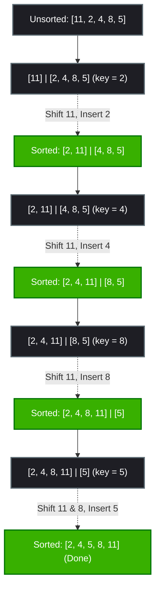

# Insertion Sort Algorithm

Insertion Sort is a simple, comparison-based sorting algorithm. It works by building a sorted sub-array one element at a time, relative to the rest of the array. It is analogous to the way most people sort a hand of playing cards: you pick one card at a time and insert it into its correct position relative to the cards already in your hand.

---

## 🔑 Key Concepts

1. **Logical Partitioning**: The array is logically split into:
   - **Sorted sub-array** (starts at index `0` with a size of 1).
   - **Unsorted sub-array** (all elements from index `1` to `N-1`).
2. **Key Selection**: In each iteration, the first element of the unsorted part is chosen as the `key`.
3. **Shifting**: Shift all elements in the sorted sub-array that are greater than the `key` one position to the right to make room for insertion.
4. **Insertion**: Insert the `key` into its correct sorted location.

---

## 🎨 Visualizing Insertion Sort (Pass-by-Pass)

Let us sort the array `[11, 2, 4, 8, 5]` using Insertion Sort.

### Legend
- `|` represents the division between the **Sorted** and **Unsorted** parts.
- The `key` being inserted is highlighted.

---

### Initial State
The first element (`11`) is considered sorted. The rest are unsorted.
```text
   Sorted │    Unsorted
  ┌───────┼───────────────────┐
  │  11   │  2 │  4 │  8 │  5 │
  └───────┴────┴────┴────┴────┘
```

---

### Pass 1
- `key = 2` (index `1`).
- Compare `key = 2` with `11`. Since `11 > 2`, shift `11` right.
- Insert `2` at index `0`.
```text
   Sorted │    Unsorted
  ┌───────┼───────────────────┐
  │  2 │ 11 │  4 │  8 │  5 │
  └───────┴────┴────┴────┴────┘
```

---

### Pass 2
- `key = 4` (index `2`).
- Compare `4` with sorted elements from right to left:
  - `11 > 4` $\rightarrow$ Shift `11` right.
  - `2 < 4` $\rightarrow$ Stop shifting.
- Insert `4` at index `1`.
```text
      Sorted  │  Unsorted
  ┌───────────┼───────────────┐
  │  2 │  4 │ 11 │  8 │  5 │
  └───────────┴────┴────┴────┘
```

---

### Pass 3
- `key = 8` (index `3`).
- Compare `8` with sorted elements:
  - `11 > 8` $\rightarrow$ Shift `11` right.
  - `4 < 8` $\rightarrow$ Stop shifting.
- Insert `8` at index `2`.
```text
         Sorted   │ Unsorted
  ┌───────────────┼───────────┐
  │  2 │  4 │  8 │ 11 │  5 │
  └───────────────┴────┴──────┘
```

---

### Pass 4
- `key = 5` (index `4`).
- Compare `5` with sorted elements:
  - `11 > 5` $\rightarrow$ Shift `11` right.
  - `8 > 5` $\rightarrow$ Shift `8` right.
  - `4 < 5` $\rightarrow$ Stop shifting.
- Insert `5` at index `2`.
```text
             Sorted
  ┌───────────────────────────┐
  │  2 │  4 │  5 │  8 │ 11 │
  └───────────────────────────┘
```

**Final Sorted Array:** `[2, 4, 5, 8, 11]`

---

## 📈 Mermaid Insertion Sort Tree

Here is how insertion sort operates on each outer step:



---

## 💻 Python Code Implementation

This Python implementation sorts the array in-place.

```python
def insertion_sort(arr):
    n = len(arr)
    
    # Outer loop to traverse from index 1 to n-1
    for i in range(1, n):
        key = arr[i]
        j = i - 1
        
        # Shift elements of arr[0..i-1], that are greater than key,
        # to one position ahead of their current position
        while j >= 0 and arr[j] > key:
            arr[j + 1] = arr[j]
            j -= 1
            
        # Place the key in its correct position
        arr[j + 1] = key
        
    return arr


# --- Execution Example ---
if __name__ == "__main__":
    test_arr = [11, 2, 4, 8, 5, 6, 7, 3, 9, 10]
    print("Unsorted Array:", test_arr)
    
    sorted_arr = insertion_sort(test_arr)
    print("Sorted Array:  ", sorted_arr)
```

---

## 📊 Complexity Analysis

### ⏱️ Time Complexity

| Case | Time Complexity | Explanation |
| :--- | :---: | :--- |
| **Best Case** | $\mathcal{O}(N)$ | Occurs when the input array is already sorted. The inner loop condition `arr[j] > key` is false immediately on the first check, resulting in only 1 comparison per outer loop step. |
| **Average Case**| $\mathcal{O}(N^2)$ | On average, half of the sorted subarray must be shifted in each step, resulting in $\mathcal{O}(N^2)$ operations. |
| **Worst Case** | $\mathcal{O}(N^2)$ | Occurs when the array is sorted in reverse order, meaning we have to shift the entire sorted section at every step. |

### 💾 Space Complexity

- **Space Complexity**: $\mathcal{O}(1)$ (Auxiliary)
- **Explanation**: Insertion Sort is an **in-place** sorting algorithm. It only requires constant extra space for variables like `key`, `i`, and `j`.

---

## ❓ Interview Questions & Answers

### 1. How does Insertion Sort build a sorted array? Explain using the analogy of playing cards.
**Answer:** Insertion Sort splits the array logically into a sorted part and an unsorted part. During each pass, it selects the first element from the unsorted part (the "key") and inserts it into its correct position within the sorted part by shifting elements that are larger than the key to the right. This is similar to how a card player organizes cards in their hand: they pick one unsorted card at a time and insert it into its correct location relative to the cards they are already holding.

### 2. What are the best-case and worst-case time complexities of Insertion Sort? Provide examples of input arrays that trigger these cases.
**Answer:**
*   **Best Case:** $O(N)$ when the input array is already sorted. The algorithm compares each key with the element immediately to its left, finds the condition `arr[j] > key` is false, and immediately moves to the next key.
*   **Worst Case:** $O(N^2)$ when the input array is sorted in reverse order. In this scenario, every new key must be compared with and shifted past all elements in the sorted sub-array.

### 3. Why is Insertion Sort preferred over more advanced algorithms like Quick Sort or Merge Sort for very small datasets?
**Answer:** Insertion Sort has minimal overhead because it sorts in-place, does not require recursion (which consumes memory call stack space), and avoids the overhead of creating auxiliary arrays. For small arrays (typically $N < 15$), the lower constant factors make it faster in practice than $O(N \log N)$ sorting algorithms.

### 4. Is Insertion Sort stable and in-place?
**Answer:** Yes, Insertion Sort is:
*   **Stable:** It only shifts elements that are strictly greater than the key (`arr[j] > key`), meaning duplicate elements retain their original relative order.
*   **In-place:** It performs sorting by shifting elements within the original array, requiring only $O(1)$ auxiliary space.

### 5. What is the behavior and performance of Insertion Sort on a "nearly sorted" array (e.g., an array where only a few elements are out of place)?
**Answer:** Insertion Sort is highly efficient on nearly sorted arrays, achieving close to linear $O(N)$ time complexity. Since elements only need to be shifted by a few positions, the inner loop terminates quickly in almost every step.

