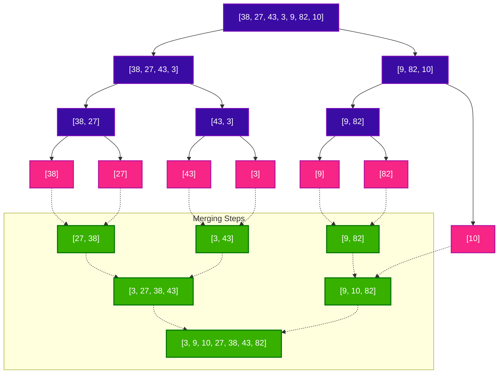

# Merge Sort Algorithm

Merge Sort is a sorting algorithm based on the **Divide and Conquer** paradigm. It works by recursively splitting the input array into halves, sorting each half, and then merging the sorted halves back together to produce the final sorted array.

---

## 🔑 Key Concepts

1. **Divide**: Split the unsorted array of size $N$ into two halves of size approximately $N/2$.
2. **Conquer**: Recursively sort both halves using Merge Sort. If the array size is 1 or 0, it is already sorted (base case).
3. **Combine (Merge)**: Merge the two sorted halves back into a single sorted array.

---

## 🎨 Visualizing Merge Sort (Phases & Boxes)

Let us sort the array `[38, 27, 43, 3, 9, 82, 10]` using Merge Sort.

### Phase 1: The Divide Phase (Splitting)
During this phase, we keep dividing the array at the middle element (`mid = len(arr) // 2`) until we reach individual elements (sub-arrays of size 1).

```text
                  ┌───────────────────────────────┐
                  │ 38 │ 27 │ 43 │ 3 │ 9 │ 82 │ 10 │  (Original Array)
                  └───────────────────────────────┘
                                  / \
                                 /   \
                 ┌───────────────────┐   ┌───────────────┐
                 │ 38 │ 27 │ 43 │ 3 │   │ 9 │ 82 │ 10 │
                 └───────────────────┘   └───────────────┘
                       / \                     / \
                      /   \                   /   \
             ┌───────────┐ ┌───────────┐ ┌───────────┐ ┌───────┐
             │  38 │ 27  │ │  43 │ 3   │ │  9 │ 82   │ │  10   │
             └───────────┘ └───────────┘ └───────────┘ └───────┘
               / \           / \           / \             │
              /   \         /   \         /   \            │
            ┌────┐ ┌────┐ ┌────┐ ┌────┐ ┌────┐ ┌────┐   ┌────┐
            │ 38 │ │ 27 │ │ 43 │ │ 3  │ │ 9  │ │ 82 │   │ 10 │ (Base Cases)
            └────┘ └────┘ └────┘ └────┘ └────┘ └────┘   └────┘
```

---

### Phase 2: The Conquer & Merge Phase (Rebuilding)
During this phase, we merge two sorted sub-arrays by comparing their smallest elements one by one, constructing a new sorted array.

```text
            ┌────┐ ┌────┐ ┌────┐ ┌────┐ ┌────┐ ┌────┐   ┌────┐
            │ 38 │ │ 27 │ │ 43 │ │ 3  │ │ 9  │ │ 82 │   │ 10 │
            └────┘ └────┘ └────┘ └────┘ └────┘ └────┘   └────┘
              \   /         \   /         \   /            │
               \ /           \ /           \ /             │  Merge Pairs
             ┌───────────┐ ┌───────────┐ ┌───────────┐     │
             │  27 │ 38  │ │  3  │ 43  │ │  9  │ 82  │     │
             └───────────┘ └───────────┘ └───────────┘     │
                   \             /             \          /
                    \           /               \        /    Merge Pairs
                 ┌───────────────────┐         ┌───────────────┐
                 │  3  │ 27 │ 38 │ 43│         │ 9 │ 10 │ 82   │
                 └───────────────────┘         └───────────────┘
                       \                               /
                        \                             /       Final Merge
                        ┌───────────────────────────────┐
                        │ 3 │ 9 │ 10 │ 27 │ 38 │ 43 │ 82│ (Sorted Array)
                        └───────────────────────────────┘
```

---

## 📈 Mermaid Merge Sort Tree

Here is how the recursion tree flows from top to bottom (Divide) and then back up (Merge).



---

## 🔍 Detailed Look at the Merge Operation

The `merge()` step is where the actual sorting happens. Let's trace how two sorted sub-arrays:
- **Left array (`L`)**: `[27, 38]` with index pointer `i`
- **Right array (`R`)**: `[3, 43]` with index pointer `j`
are merged into the target array `[38, 27, 43, 3]` at index `k`.

### Merge Trace Table

| Step | `L[i]` | `R[j]` | Comparison | Action | Resulting Array | Pointer State |
| :--- | :---: | :---: | :--- | :--- | :--- | :--- |
| **Initial** | `L[0]=27` | `R[0]=3` | - | Initialize pointers | `[_, _, _, _]` | `i=0, j=0, k=0` |
| **1** | `27` | `3` | `27 > 3` (Right is smaller) | Put `3` in array; increment `j` and `k` | `[3, _, _, _]` | `i=0, j=1, k=1` |
| **2** | `27` | `43` | `27 <= 43` (Left is smaller)| Put `27` in array; increment `i` and `k` | `[3, 27, _, _]` | `i=1, j=1, k=2` |
| **3** | `38` | `43` | `38 <= 43` (Left is smaller)| Put `38` in array; increment `i` and `k` | `[3, 27, 38, _]` | `i=2, j=1, k=3` |
| **Loop End** | - | `43` | `L` is fully processed | Exit loop. Copy remaining `R` elements | `[3, 27, 38, 43]` | `i=2, j=2, k=4` |

---

## 💻 Python Code Implementation

This Python implementation sorts the array in-place (consistent with the implementation style of the earlier classes).

```python
def merge_sort(arr):
    # Base Case: Arrays with 0 or 1 element are already sorted
    if len(arr) <= 1:
        return arr

    # 1. Find the mid-point and split the array
    mid = len(arr) // 2
    left_half = arr[:mid]
    right_half = arr[mid:]

    # 2. Recursively sort both halves
    merge_sort(left_half)
    merge_sort(right_half)

    # 3. Merge the sorted halves back together in-place
    i = 0  # Pointer for left_half (L)
    j = 0  # Pointer for right_half (R)
    k = 0  # Pointer for original array (arr)

    # Compare elements from L and R, and copy the smaller one back to arr
    while i < len(left_half) and j < len(right_half):
        if left_half[i] <= right_half[j]:
            arr[k] = left_half[i]
            i += 1
        else:
            arr[k] = right_half[j]
            j += 1
        k += 1

    # If any elements remain in left_half, copy them over
    while i < len(left_half):
        arr[k] = left_half[i]
        i += 1
        k += 1

    # If any elements remain in right_half, copy them over
    while j < len(right_half):
        arr[k] = right_half[j]
        j += 1
        k += 1

    return arr


# --- Execution Example ---
if __name__ == "__main__":
    test_arr = [38, 27, 43, 3, 9, 82, 10]
    print("Unsorted Array:", test_arr)
    
    sorted_arr = merge_sort(test_arr)
    print("Sorted Array:  ", sorted_arr)
```

---

## 📊 Complexity Analysis

### ⏱️ Time Complexity

| Case | Time Complexity | Explanation |
| :--- | :---: | :--- |
| **Best Case** | $\mathcal{O}(N \log N)$ | Even if the array is already sorted, the algorithm will still split it down to single elements and merge them back together. |
| **Average Case**| $\mathcal{O}(N \log N)$ | In all cases, the array is divided into two halves ($\log N$ levels of division), and at each level, merging takes linear time $\mathcal{O}(N)$. |
| **Worst Case** | $\mathcal{O}(N \log N)$ | No configuration of elements causes extra comparisons beyond the logarithmic split and linear merge steps. |

### 💾 Space Complexity

- **Space Complexity**: $\mathcal{O}(N)$
- **Explanation**: Merge Sort is **not** an in-place sorting algorithm in its standard implementation. Auxiliary sub-arrays (`left_half` and `right_half`) of size sum equal to $N$ are created at each recursion step to store the split parts. The maximum height of the recursion call stack is $\mathcal{O}(\log N)$, but the space taken by temporary slices dominates at $\mathcal{O}(N)$.
