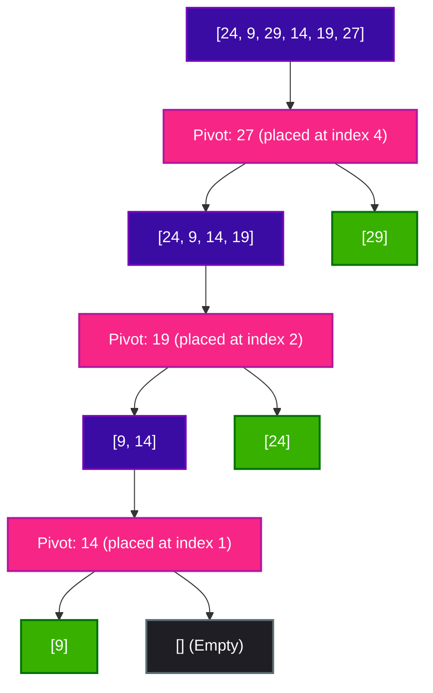

# Quick Sort Algorithm

Quick Sort is a highly efficient, comparison-based sorting algorithm that uses a **Divide and Conquer** strategy. Like Merge Sort, it recursively divides the problem into smaller subproblems. However, unlike Merge Sort, which merges sorted sub-arrays, Quick Sort partitions the array around a chosen element called a **pivot**, ensuring that elements smaller than the pivot go to its left, and larger elements go to its right.

---

## 🔑 Key Concepts

1. **Choose Pivot**: Pick an element from the array to act as the "pivot" (common strategies include picking the first element, last element, middle element, or a random element).
2. **Partitioning**: Rearrange the array so that:
   - All elements smaller than the pivot are moved to its left.
   - All elements greater than the pivot are moved to its right.
   - The pivot element is now in its final sorted position.
3. **Recurse**: Recursively apply the same logic to the sub-array on the left of the pivot and the sub-array on the right of the pivot.

---

## 🎨 Visualizing Quick Sort Partitioning (Step-by-Step)

Let us visualize the Lomuto partitioning process on the array `[24, 9, 29, 14, 19, 27]` where the pivot is selected as the last element (`27`).

### Legend
- `i` keeps track of the boundary of elements smaller than or equal to the pivot.
- `j` scans the array to find elements smaller than or equal to the pivot.
- `Pivot` is highlighted in double boxes.

---

### Step 0: Initial State
The scan pointer `j` starts at index `0`. The boundary pointer `i` starts at `-1`.
```text
 i = -1
  ┌────┬────┬────┬────┬────┬════╪
  │ 24 │  9 │ 29 │ 14 │ 19 │ 27 │ (Pivot = 27)
  └────┴────┴────┴────┴────┴════╪
    ↑
   j=0
```

### Step 1: j = 0
- Compare `arr[j]` (`24`) with `Pivot` (`27`).
- Since `24 <= 27`, increment `i` to `0`, and swap `arr[0]` with `arr[0]` (swaps with itself).
```text
  i = 0
  ┌────┬────┬────┬────┬────┬════╪
  │ 24 │  9 │ 29 │ 14 │ 19 │ 27 │
  └────┴────┴────┴────┴────┴════╪
    ↑
    j
```

### Step 2: j = 1
- Compare `arr[j]` (`9`) with `Pivot` (`27`).
- Since `9 <= 27`, increment `i` to `1`, and swap `arr[1]` with `arr[1]` (swaps with itself).
```text
       i = 1
  ┌────┬────┬────┬────┬────┬════╪
  │ 24 │  9 │ 29 │ 14 │ 19 │ 27 │
  └────┴────┴────┴────┴────┴════╪
         ↑
         j
```

### Step 3: j = 2
- Compare `arr[j]` (`29`) with `Pivot` (`27`).
- Since `29 > 27`, we do nothing. Pointers update:
```text
       i = 1
  ┌────┬────┬────┬────┬────┬════╪
  │ 24 │  9 │ 29 │ 14 │ 19 │ 27 │
  └────┴────┴────┴────┴────┴════╪
              ↑
              j
```

### Step 4: j = 3
- Compare `arr[j]` (`14`) with `Pivot` (`27`).
- Since `14 <= 27`, increment `i` to `2`, and swap `arr[2]` (`29`) with `arr[3]` (`14`).
```text
            i = 2
  ┌────┬────┬────┬────┬────┬════╪
  │ 24 │  9 │ 14 │ 29 │ 19 │ 27 │
  └────┴────┴────┴────┴────┴════╪
                   ↑
                   j
```

### Step 5: j = 4
- Compare `arr[j]` (`19`) with `Pivot` (`27`).
- Since `19 <= 27`, increment `i` to `3`, and swap `arr[3]` (`29`) with `arr[4]` (`19`).
```text
                 i = 3
  ┌────┬────┬────┬────┬────┬════╪
  │ 24 │  9 │ 14 │ 19 │ 29 │ 27 │
  └────┴────┴────┴────┴────┴════╪
                        ↑
                        j
```

### Step 6: Final Swap
- The scan loop ends. Swap `arr[i + 1]` (`arr[4] = 29`) with `Pivot` (`arr[5] = 27`).
- The pivot `27` is now in its correct sorted position!
```text
                      i+1 = 4
  ┌────┬────┬────┬────┬════┬────┐
  │ 24 │  9 │ 14 │ 19 │ 27 │ 29 │ (Pivot 27 is sorted)
  └────┴────┴────┴────┴════┴────┘
```

---

## 📈 Mermaid Quick Sort Recursion Tree

Here is how the partition points are recursively decided and how the array splits dynamically around the pivots:



---

## 🔍 Detailed Look at the Partition Operation

The `partition()` helper is the core component of Quick Sort. Below is the step-by-step trace of how pointers `i` and `j` manipulate the elements of array `arr = [24, 9, 29, 14, 19, 27]`.

### Partition Trace Table

| Step | `j` | `arr[j]` | Comparison | Action | Resulting Array | Pointer State |
| :--- | :---: | :---: | :--- | :--- | :--- | :--- |
| **Initial** | - | - | - | Initialize pointers; Pivot = `27` | `[24, 9, 29, 14, 19, 27]` | `i = -1, j = 0` |
| **1** | `0` | `24` | `24 <= 27` (True) | Increment `i`, swap `arr[0]` and `arr[0]` | `[24, 9, 29, 14, 19, 27]` | `i = 0, j = 0` |
| **2** | `1` | `9` | `9 <= 27` (True) | Increment `i`, swap `arr[1]` and `arr[1]` | `[24, 9, 29, 14, 19, 27]` | `i = 1, j = 1` |
| **3** | `2` | `29` | `29 <= 27` (False) | Do nothing | `[24, 9, 29, 14, 19, 27]` | `i = 1, j = 2` |
| **4** | `3` | `14` | `14 <= 27` (True) | Increment `i`, swap `arr[2]` (`29`) and `arr[3]` (`14`) | `[24, 9, 14, 29, 19, 27]` | `i = 2, j = 3` |
| **5** | `4` | `19` | `19 <= 27` (True) | Increment `i`, swap `arr[3]` (`29`) and `arr[4]` (`19`) | `[24, 9, 14, 19, 29, 27]` | `i = 3, j = 4` |
| **Final** | - | - | Loop End | Swap `arr[i + 1]` (`29`) and Pivot (`27`) | `[24, 9, 14, 19, 27, 29]` | `i = 3, j = 5` |

---

## 💻 Python Code Implementation

This Python implementation sorts the array in-place, modifying the input array directly and returning it.

```python
def partition(arr, low, high):
    # Select the rightmost element as the pivot
    pivot = arr[high]
    i = low - 1  # Index of the smaller element
    
    for j in range(low, high):
        # If the current element is smaller than or equal to the pivot
        if arr[j] <= pivot:
            i += 1
            arr[i], arr[j] = arr[j], arr[i]
            
    # Place pivot in its correct sorted position by swapping with element at i+1
    arr[i + 1], arr[high] = arr[high], arr[i + 1]
    return i + 1


def quick_sort(arr, low=0, high=None):
    if high is None:
        high = len(arr) - 1
        
    # Base Case: recurse only if there is more than 1 element to sort
    if low < high:
        # Partition the array and retrieve the pivot's final index
        pivot_index = partition(arr, low, high)
        
        # Recursively sort elements before and after partition
        quick_sort(arr, low, pivot_index - 1)
        quick_sort(arr, pivot_index + 1, high)
        
    return arr


# --- Execution Example ---
if __name__ == "__main__":
    test_arr = [24, 9, 29, 14, 19, 27]
    print("Unsorted Array:", test_arr)
    
    sorted_arr = quick_sort(test_arr)
    print("Sorted Array:  ", sorted_arr)
```

---

## 📊 Complexity Analysis

### ⏱️ Time Complexity

| Case | Time Complexity | Explanation |
| :--- | :---: | :--- |
| **Best Case** | $\mathcal{O}(N \log N)$ | Occurs when the partition process always divides the array into two nearly equal halves. |
| **Average Case**| $\mathcal{O}(N \log N)$ | On average, random pivots divide the array in a reasonably balanced manner, leading to logarithmic depth levels. |
| **Worst Case** | $\mathcal{O}(N^2)$ | Occurs when the pivot is consistently the smallest or largest element (e.g., sorting an already sorted or reverse-sorted array using Lomuto partition without randomization). |

### 💾 Space Complexity

- **Space Complexity**: $\mathcal{O}(\log N)$ (Average auxiliary stack space)
- **Explanation**: Quick Sort is an **in-place** sorting algorithm (auxiliary space for storage is $\mathcal{O}(1)$). However, memory is consumed on the call stack due to recursion. In the average/best case, stack depth is $\mathcal{O}(\log N)$. In the worst case, the call stack can grow up to $\mathcal{O}(N)$.
