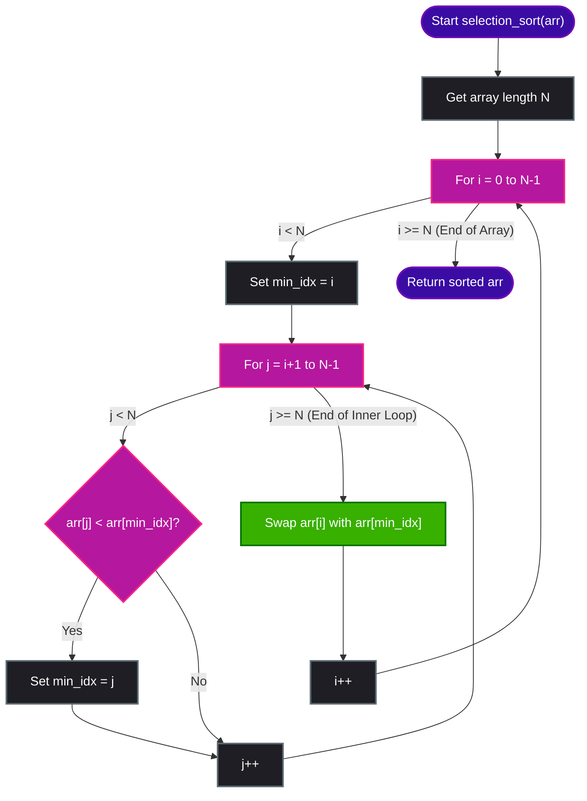

# Selection Sort Algorithm

Selection Sort is a simple comparison-based sorting algorithm. It works by dividing the input list into two parts: a **sorted** sub-list at the left end and an **unsorted** sub-list at the right end. In each step, the algorithm finds the smallest element from the unsorted sub-list and swaps it with the leftmost unsorted element, growing the sorted sub-list by one.

---

## 🔑 Key Concepts

1. **Partitioning**: The array is logically split into `Sorted | Unsorted`. Initially, the sorted part is empty, and the unsorted part is the entire array.
2. **Find Minimum**: Find the index of the minimum element in the unsorted sub-array.
3. **Swap**: Swap this minimum element with the first element of the unsorted sub-array.
4. **Advance**: Move the partition line one step to the right.

---

## 🎨 Visualizing Selection Sort (Pass-by-Pass)

Let us sort the array `[29, 10, 14, 37, 13]` using Selection Sort.

### Legend
- `|` represents the boundary divider between the **Sorted** and **Unsorted** parts.
- `i` represents the current start index of the unsorted sub-array.
- `min` represents the index of the smallest element in the unsorted sub-array.

---

### Initial State
The sorted sub-array is empty. The entire array is unsorted.
```text
  Sorted  |               Unsorted
 ┌────────┼──────────────────────────────────┐
 │        │  29  │  10  │  14  │  37  │  13  │
 └────────┴──────┴──────┴──────┴──────┴──────┘
             ↑
           i = 0
```

---

### Pass 1
1. Find the smallest element from index `i = 0` to `4`. The minimum element is `10` (at index `1`).
2. Swap the elements at index `i = 0` (value `29`) and index `min = 1` (value `10`).

```text
               ┌─────── Swap ──────┐
               ▼                   ▼
 ┌────────┼──────────────────────────────────┐
 │        │  29  │  10  │  14  │  37  │  13  │
 └────────┴──────┴──────┴──────┴──────┴──────┘
             ↑      ↑
             i     min
```

**Result after Pass 1:**
```text
   Sorted │               Unsorted
 ┌────────┼──────────────────────────────────┐
 │   10   │  29  │  14  │  37  │  13  │
 └────────┴──────┴──────┴──────┴──────┘
             ↑
           i = 1
```

---

### Pass 2
1. Find the smallest element from index `i = 1` to `4`. The minimum element is `13` (at index `4`).
2. Swap the elements at index `i = 1` (value `29`) and index `min = 4` (value `13`).

```text
                     ┌───────── Swap ────────┐
                     ▼                       ▼
 ┌────────┼──────────────────────────────────┐
 │   10   │  29  │  14  │  37  │  13  │
 └────────┴──────┴──────┴──────┴──────┘
             ↑                       ↑
             i                      min
```

**Result after Pass 2:**
```text
      Sorted     │           Unsorted
 ┌───────────────┼───────────────────────────┐
 │   10  │  13   │  14  │  37  │  29  │
 └───────┴───────┴──────┴──────┴──────┘
                    ↑
                  i = 2
```

---

### Pass 3
1. Find the smallest element from index `i = 2` to `4`. The minimum element is `14` (at index `2`).
2. Since `i` and `min` point to the same index, no physical swap is necessary (or we swap it with itself).

```text
 ┌───────────────┼───────────────────────────┐
 │   10  │  13   │  14  │  37  │  29  │
 └───────┴───────┴──────┴──────┴──────┘
                    ↑
                  i, min
```

**Result after Pass 3:**
```text
          Sorted        │       Unsorted
 ┌──────────────────────┼────────────────────┐
 │   10  │  13  │  14   │  37  │  29  │
 └───────┴──────┴───────┴──────┴──────┘
                            ↑
                          i = 3
```

---

### Pass 4
1. Find the smallest element from index `i = 3` to `4`. The minimum element is `29` (at index `4`).
2. Swap the elements at index `i = 3` (value `37`) and index `min = 4` (value `29`).

```text
                             ┌── Swap ──┐
                             ▼          ▼
 ┌──────────────────────┼────────────────────┐
 │   10  │  13  │  14   │  37  │  29  │
 └───────┴──────┴───────┴──────┴──────┘
                            ↑          ↑
                            i         min
```

**Result after Pass 4:**
```text
              Sorted           │  Unsorted
 ┌─────────────────────────────┼─────────────┐
 │   10  │  13  │  14  │  29   │  37  │
 └───────┴──────┴──────┴───────┴──────┘
                                  ↑
                                i = 4
```

---

### Final State (Pass 5)
There is only one element remaining in the unsorted section (`37`). By default, it must be in the correct position. The array is fully sorted!

```text
                    Sorted
 ┌───────────────────────────────────────────┐
 │   10  │  13  │  14  │  29  │  37  │
 └───────┴──────┴──────┴──────┴──────┘
```

---

## 📈 Mermaid Flowchart of Selection Sort Logic

The flowchart below demonstrates the inner and outer loops of the Selection Sort algorithm:



---

## 💻 Python Code Implementation

This Python implementation sorts the array in-place, modifying the input array directly and returning it.

```python
def selection_sort(arr):
    n = len(arr)
    
    # Traverse through all array elements
    for i in range(n):
        # Find the minimum element in the remaining unsorted array
        min_idx = i
        for j in range(i + 1, n):
            # Compare current element with current known minimum
            if arr[j] < arr[min_idx]:
                min_idx = j
                
        # Swap the found minimum element with the first unsorted element
        arr[i], arr[min_idx] = arr[min_idx], arr[i]
        
    return arr


# --- Execution Example ---
if __name__ == "__main__":
    test_arr = [29, 10, 14, 37, 13]
    print("Unsorted Array:", test_arr)
    
    sorted_arr = selection_sort(test_arr)
    print("Sorted Array:  ", sorted_arr)
```

---

## 📊 Complexity Analysis

### ⏱️ Time Complexity

| Case | Time Complexity | Explanation |
| :--- | :---: | :--- |
| **Best Case** | $\mathcal{O}(N^2)$ | Even if the array is already sorted, the algorithm checks all remaining elements to verify they are not smaller than the current element. |
| **Average Case**| $\mathcal{O}(N^2)$ | On average, for each of the $N$ positions, it scans the remaining array to find the minimum, leading to $\frac{N(N-1)}{2}$ comparisons. |
| **Worst Case** | $\mathcal{O}(N^2)$ | In the worst case (e.g., reverse-sorted array), the nested loops still run the full $\mathcal{O}(N^2)$ comparison iterations. |

### 💾 Space Complexity

- **Space Complexity**: $\mathcal{O}(1)$ (Auxiliary)
- **Explanation**: Selection Sort is an **in-place** sorting algorithm. It only requires a constant amount of extra memory space (variables like `min_idx`, `i`, and `j`) to swap elements within the existing array structure.
