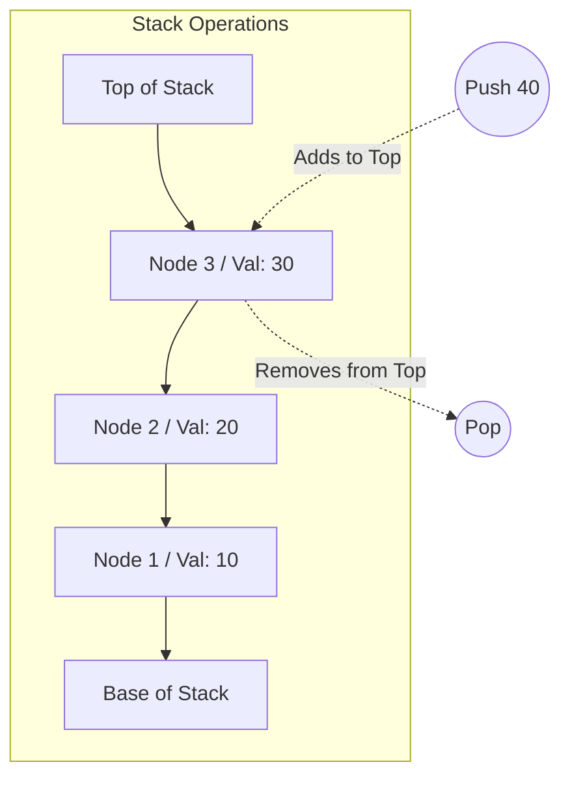

# Stacks and Queues

This directory contains the theory and implementations for two of the most fundamental linear data structures: **Stacks** and **Queues**.

---

## 1. The Stack Data Structure

A **Stack** is a linear data structure that follows the **Last-In, First-Out (LIFO)** principle. The element that is added last is the first one to be removed. 

Think of a stack of plates: you can only add a new plate to the top, and you can only remove a plate from the top.



### Core Operations & Time Complexities

All core operations on a stack are highly efficient and run in constant time:

| Operation | Description | Time Complexity | Space Complexity |
| :--- | :--- | :--- | :--- |
| **Push** | Adds an element to the top of the stack. | $O(1)$ | $O(1)$ |
| **Pop** | Removes and returns the top element from the stack. | $O(1)$ | $O(1)$ |
| **Peek / Top** | Returns the top element without removing it. | $O(1)$ | $O(1)$ |
| **IsEmpty** | Checks if the stack is empty. | $O(1)$ | $O(1)$ |
| **Size** | Returns the number of elements in the stack. | $O(1)$ | $O(1)$ |

### Common Applications

- **Function Call Stack:** Managing active subroutines, local variables, and return addresses in recursive programming.
- **Undo / Redo Mechanisms:** Tracking state history in text editors or graphic software (pressing `Ctrl+Z` pops the last action).
- **Expression Evaluation:** Parsing and evaluating mathematical expressions (e.g., converting Infix to Postfix/Prefix, matching brackets/parentheses).
- **Backtracking:** Used in algorithms like Depth-First Search (DFS) to explore paths and backtrack when hitting dead ends.

---

## 2. The Queue Data Structure

A **Queue** is a linear data structure that follows the **First-In, First-Out (FIFO)** principle. The element that is added first is the first one to be removed.

Think of a line of people waiting for a ticket: the person who gets in line first is served first, and new arrivals join at the end of the line.

```mermaid
graph LR
    subgraph Queue Flow
        direction LR
        Front[Front / Dequeue] <-- Node1[Val: 10]
        Node1 <-- Node2[Val: 20]
        Node2 <-- Node3[Val: 30]
        Node3 <-- Rear[Rear / Enqueue]
    end
    
    Enqueue((Enqueue 40)) -.-> Rear
    Front -.-> Dequeue((Dequeue))
```

### Core Operations & Time Complexities

| Operation | Description | Time Complexity | Space Complexity |
| :--- | :--- | :--- | :--- |
| **Enqueue** | Adds an element to the rear/end of the queue. | $O(1)$ | $O(1)$ |
| **Dequeue** | Removes and returns the front/head element from the queue. | $O(1)$ | $O(1)$ |
| **Peek / Front** | Returns the front element without removing it. | $O(1)$ | $O(1)$ |
| **IsEmpty** | Checks if the queue is empty. | $O(1)$ | $O(1)$ |
| **Size** | Returns the number of elements in the queue. | $O(1)$ | $O(1)$ |

### Types of Queues

1. **Simple / Linear Queue:** Standard FIFO queue. Insertion is at the rear; deletion is at the front.
2. **Circular Queue:** The last position is connected back to the first position, making a circle. This avoids memory wastage when elements are dequeued.
3. **Double-Ended Queue (Deque):** Allows insertions and deletions at both the front and rear ends.
4. **Priority Queue:** Elements are served based on their priority. An element with higher priority is dequeued before an element with lower priority.

### Common Applications

- **CPU / Task Scheduling:** Managing background processes waiting for resources (e.g., Round Robin Scheduling).
- **Breadth-First Search (BFS):** Graph and tree traversal algorithms use queues to track visited nodes level-by-level.
- **Buffers:** Handling asynchronous data transfer (e.g., IO buffers, pipe communication, printer spooling).
- **Message Queues:** Decoupling producers and consumers in distributed systems (e.g., RabbitMQ, Kafka).

---

## 3. Implementations Overview

In [stacks_and_queues.py](file:///Users/ronitjaiprakash/Desktop/Classes/stacks_and_queues/stacks_and_queues.py), we provide:
1. **ListStack / NodeStack:** Stack implementations using standard Python lists and linked nodes.
2. **DequeQueue / NodeQueue:** Queue implementations using `collections.deque` and linked nodes (which ensures $O(1)$ enqueue and dequeue times).

### How to Run:
```bash
python3 stacks_and_queues/stacks_and_queues.py
```
